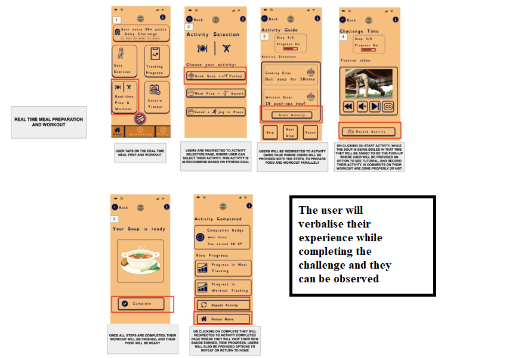

# YallaFitfusionLifestyle-App

A comprehensive fitness application designed to make your fitness journey accessible and engaging for everyone, with special attention to accessibility features.

## 🚀 Features

- **AI-Powered Assistance**: Get real-time guidance during workouts
- **Accessibility First**: Designed with various accessibility needs in mind
- **Challenges & Progress Tracking**: Stay motivated with challenges and track your progress
- **Social Features**: Connect with friends and share your fitness journey
- **Meal Planning**: Combine nutrition with your workout plans

## 📱 Screenshots

### Getting Started

| Welcome Screen | Sign Up Page |
|----------------|--------------|
|  |  |

### Core Features

| AI Chat Assistance | Real-time Audio Guidance |
|--------------------|--------------------------|
|  |  |

### Challenges & Progress

| Daily Challenges | Push-up Challenge | Meal Prep Challenge |
|------------------|-------------------|---------------------|
|  |  |  |

### User Profile & Social

| Profile Page | Friends Invite |
|--------------|----------------|
|  |  |

### Accessibility Features

| Visual Adjustments | Dyslexia Support | Motion & Sensory |
|--------------------|------------------|------------------|
|  |  |  |

### Analytics & Performance

| Progress Indicators | Task Performance | Error Rate Analysis |
|---------------------|------------------|---------------------|
|  |  |  |

## 📊 User Experience Metrics

| SUS Score | Binary Success Rate | Response Categories |
|-----------|---------------------|---------------------|
|  |  |  |

## 🛠️ Technical Implementation

### User Research
- Think Aloud Protocol: 
- User-Centric Challenges: 
- SUS Score Heatmap: 
- Task Performance: 

## 📝 How to Use

1. Sign up or log in to your account
2. Complete your profile with your fitness goals
3. Explore different workout challenges
4. Track your progress and earn achievements
5. Connect with friends for extra motivation

## 🌟 Features in Detail

### AI-Powered Workouts
Get real-time feedback and form correction with our advanced AI assistance.

### Accessibility
Our app includes various accessibility features to ensure everyone can use it comfortably, including:
- Text-to-speech
- High contrast modes
- Adjustable text sizes
- Motion reduction options

### Community Challenges
Join community-wide fitness challenges and compete with friends to stay motivated.

## 📱 Compatibility

- iOS 14.0+
- Android 8.0+
- Web version available

## 📬 Contact

For support or feature requests, please open an issue on our GitHub repository.

## 📄 License

This project is licensed under the MIT License - see the LICENSE file for details.
